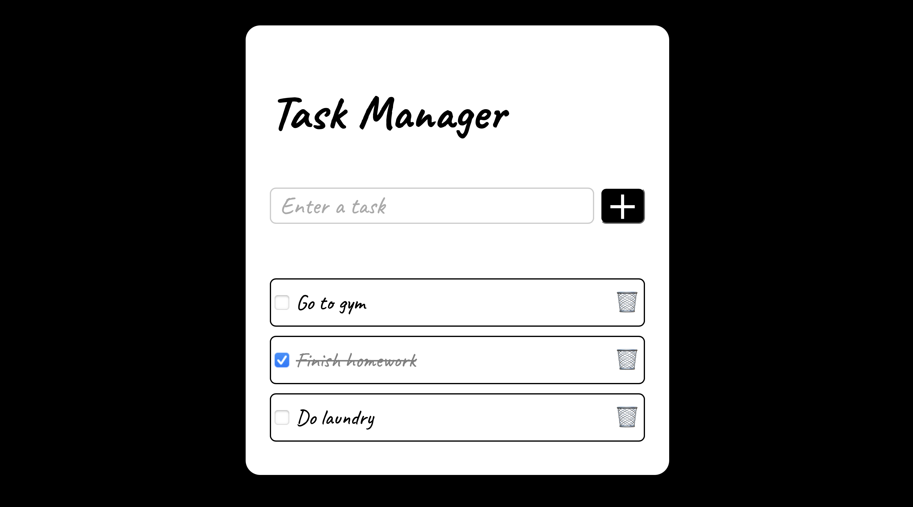

# Flask Task Manager



A full-stack task manager I built to learn how to connect a Python Flask backend with a JavaScript frontend. It features drag and drop reordering built from scratch and saves data to a local JSON file.

## Features

- **Live Updates:** Tasks can be added, deleted, reordered, and checked off using Javascript Fetch API.
- **Drag and Drop:** I wrote a custom algorithm that uses mouse coordinates to reorder tasks.
- **Persistence:** Data is saved to a `tasks.json` file.
- **UI:** Works on both mobile and desktop.
- **Themes:** Includes a small Easter Egg where typing specific dates changes the background color.

## Tech Stack

- **Backend:** Python 3, Flask
- **Frontend:** HTML5, CSS3, JavaScript
- **Data Storage:** JSON file

## Installation and Setup

### 1. Clone the Repository

```bash
git clone https://github.com/YOUR_USERNAME/task-manager.git
cd task-manager
```

### 2. Set Up a Virtual Environment

```bash
python3 -m venv venv
source venv/bin/activate  # On Windows, use `venv\Scripts\activate`
```

### 3. Install Dependencies

```bash
pip install -r requirements.txt
```

### 4. Run the Application

```bash
python3 app.py
```

### 5. Access the Application

Open your browser and navigate to the URL displayed in the terminal.

## Future Improvements

- Implementing user authentication
- Adding due dates and priority tags